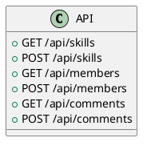
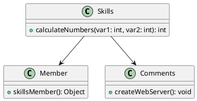

# Technical Design Document

## 1. Introduction
- Purpose of the project: This project is designed to demonstrate the use of GitHub Copilot and Codespaces for efficient coding and collaboration.
- Scope and objectives: The project includes setting up a development environment, writing JavaScript code, and using GitHub Copilot for code suggestions.

## 2. Architecture Overview
- High-level summary: The project consists of a development environment setup using Codespaces, JavaScript files for demonstrating Copilot's capabilities, and GitHub Actions workflows for automation.
-   
  _See PlantUML code in Appendix A_

## 3. Major Components
| Component Name | Responsibility | Key Files/Modules |
|----------------|----------------|-------------------|
| Development Environment | Setting up Codespaces and installing necessary extensions | .devcontainer/devcontainer.json |
| JavaScript Files | Demonstrating Copilot's capabilities | skills.js, member.js, comments.js |
| GitHub Actions Workflows | Automating tasks and steps in the project | .github/workflows/0-welcome.yml, .github/workflows/1-copilot-extension.yml, .github/workflows/2-skills-javascript.yml |

## 4. API Design
- API endpoints and structure: Not applicable for this project.
-   
  _See PlantUML code in Appendix B_

## 5. Class/Module Design
- Main classes/modules and relationships: The project includes JavaScript files with functions demonstrating Copilot's capabilities.
-   
  _See PlantUML code in Appendix C_

## 6. Data Flow & Integration
- How components interact, sequence flows: The project demonstrates the interaction between Codespaces, JavaScript files, and GitHub Actions workflows.
-   
  _See PlantUML code in Appendix D_

## 7. Key Technologies & Libraries
- GitHub Copilot: AI-powered code suggestions
- GitHub Codespaces: Development environment
- JavaScript: Programming language
- GitHub Actions: Automation and CI/CD

## 8. Error Handling & Logging
- Error handling and logging are not explicitly covered in this project.

## 9. Security Considerations
- Security considerations are not explicitly covered in this project.

## 10. Deployment & Environment
- The project is developed and tested within GitHub Codespaces.

## 11. Future Improvements
- Expand the project to include more complex code examples and use cases for GitHub Copilot.
- Add error handling and logging mechanisms.
- Include security best practices and considerations.

---

## Appendix

### Appendix A: System Architecture Diagram (PlantUML)
```plantuml
@startuml
!define RECTANGLE class
!define INTERFACE interface
!define DATABASE database

RECTANGLE "User" as user
RECTANGLE "Web Server" as webServer
RECTANGLE "Application Server" as appServer
DATABASE "Database" as database

user --> webServer : "HTTP Request"
webServer --> appServer : "API Call"
appServer --> database : "SQL Query"
database --> appServer : "SQL Result"
appServer --> webServer : "API Response"
webServer --> user : "HTTP Response"
@enduml
```

### Appendix B: API Diagram (PlantUML)


### Appendix C: Class Diagram (PlantUML)


### Appendix D: Integration Diagram (PlantUML)
```plantuml
actor User
participant "Web Browser" as Browser
participant "Web Server" as Server
participant "Database" as DB

User -> Browser : Request Page
Browser -> Server : HTTP Request
Server -> DB : Query Data
DB -> Server : Return Data
Server -> Browser : HTTP Response
Browser -> User : Display Page
@enduml
```
